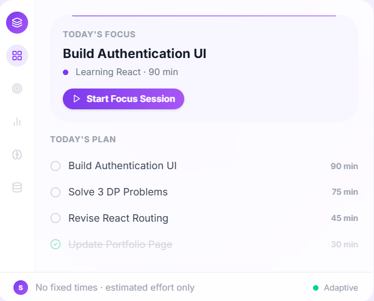

# ManageIt

### Intelligent Productivity Planner

ManageIt is a productivity and planning application that helps users turn larger goals into actionable tasks and automatically organize their workload around their available time.

Instead of simply maintaining a to-do list, ManageIt considers task deadlines, priorities, estimated effort, progress, and daily capacity to generate a realistic schedule. Users can then review and manually adjust their schedule through an interactive planner.

---

## Links

- **Live Demo:** [ManageIt](YOUR_LIVE_DEMO_URL)
- **GitHub Repository:** [ManageIt](YOUR_GITHUB_REPOSITORY_URL)

---

## Preview

---

## Features

### Authentication

- Email/password authentication
- Google authentication
- Protected dashboard for authenticated users
- User-specific data stored securely in Firebase

### Plans & Tasks

- Create, edit, and delete plans
- Set plan deadlines and descriptions
- Create tasks within plans
- Set task priority and estimated duration
- Mark tasks as completed
- Track task-level and plan-level progress
- Automatic plan health status:
  - On Track
  - At Risk
  - Overdue
  - Completed
  - Not Started

### Intelligent Scheduling

ManageIt's core scheduling engine automatically distributes unfinished work across available days.

The scheduler considers:

- Plan deadlines
- Task priority
- Estimated task duration
- Progress already completed
- Daily working capacity
- Day-specific capacity overrides
- Pinned task dates

Large tasks can be split across multiple days when the available capacity is insufficient for completing them in one session.

The scheduler also detects situations where the workload cannot realistically fit within the available time and provides warnings.

### Interactive Planner

- Weekly planner view
- Monthly calendar view
- Automatically generated daily workload
- Drag-and-drop task rescheduling
- Pin and unpin tasks to specific dates
- Move unfinished work forward
- Auto-balance overloaded days
- Adjust task duration directly from the planner
- Configure default and date-specific daily capacity

### Focus Sessions

- Start a focus session directly from a task
- Live session timer
- End and save completed focus sessions
- Record time spent working on tasks
- Update task progress after a focus session

### Insights

ManageIt provides execution-based insights using actual task and focus-session data.

Current insights include:

- Tasks completed
- Overall completion rate
- Total focus time
- Number of focus sessions
- Average focus-session duration
- Weekly focus-time visualization
- Plan health breakdown

### Knowledge

- Create notes associated with plans
- Save useful links
- Search saved resources
- Pin important resources
- Edit notes
- Move resources between plans
- Delete resources
- Access knowledge directly from individual plans

### Personalization

- Dark/light appearance settings
- Configurable daily capacity

---

## Architecture

ManageIt uses a React-based frontend with Firebase providing authentication and persistent data storage.

    ManageIt
       |
       +-- React Frontend
       |      |
       |      +-- Plans
       |      +-- Planner
       |      +-- Insights
       |      +-- Focus Sessions
       |      +-- Knowledge
       |
       +-- Firebase
              |
              +-- Authentication
              +-- Cloud Firestore

### Scheduling Flow

    Plans + Tasks
         |
         v
    Filter completed tasks
         |
         v
    Calculate remaining work
         |
         v
    Sort by deadline + priority
         |
         v
    Apply daily capacity
         |
         +-- Pinned dates
         +-- Capacity overrides
         +-- Task splitting
         |
         v
    Generate schedule
         |
         v
    Warnings for infeasible workload

---

## Data Model

ManageIt uses Cloud Firestore with user-scoped data.

    users/
      {userId}/
        plans/
          {planId}/
            tasks/
              {taskId}/
                focusSessions/
                  {sessionId}

        knowledge/
          {resourceId}

        capacityOverrides/
          {date}

        sessions/
          {sessionId}

Each user's application data is scoped using their Firebase Authentication UID.

---

## Tech Stack

### Frontend

- React
- React Router
- Vite
- Tailwind CSS
- Lucide React

### Backend / Cloud Services

- Firebase Authentication
- Cloud Firestore

### Development

- JavaScript
- ESLint

---

## Getting Started

### 1. Clone the repository

    git clone <your-repository-url>
    cd ManageIt

### 2. Install dependencies

    npm install

### 3. Configure Firebase

Create a Firebase project and enable:

- Authentication
- Cloud Firestore

Add your Firebase configuration to the project.

### 4. Start the development server

    npm run dev

The application will be available at the local Vite development URL.

---

## Project Structure

    src/
    ├── components/
    │   ├── PlansSection.jsx
    │   ├── PlanDetail.jsx
    │   ├── PlannerSection.jsx
    │   ├── OverviewSection.jsx
    │   ├── InsightsSection.jsx
    │   ├── KnowledgeSection.jsx
    │   ├── FocusBar.jsx
    │   └── ...
    │
    ├── pages/
    │   ├── Landing.jsx
    │   ├── Login.jsx
    │   ├── Signup.jsx
    │   └── Dashboard.jsx
    │
    ├── services/
    │   ├── planService.js
    │   ├── capacityService.js
    │   ├── focusService.js
    │   ├── knowledgeService.js
    │   └── userService.jsx
    │
    ├── utils/
    │   ├── scheduler.js
    │   ├── progress.js
    │   ├── planStatus.js
    │   ├── format.js
    │   └── errors.js
    │
    ├── context/
    │   └── AuthContext.jsx
    │
    └── config/
        └── Firebase.js

---

## Why ManageIt?

Traditional task managers tell you what needs to be done.

ManageIt also tries to answer:

> When should I actually do it?

By combining task management with workload-aware scheduling, the application aims to make planning more realistic for users who have limited time and multiple deadlines.

---

## Future Improvements

- AI-powered planning assistance
- More advanced productivity analytics
- Expanded focus-session functionality
- Additional calendar integrations
- More flexible task scheduling constraints
- Improved navigation and routing
- Additional knowledge/resource types

---

## Project Status

ManageIt is an actively developed project focused on combining task management with intelligent, workload-aware scheduling.

The application is being developed incrementally, with additional features and refinements planned for future versions.